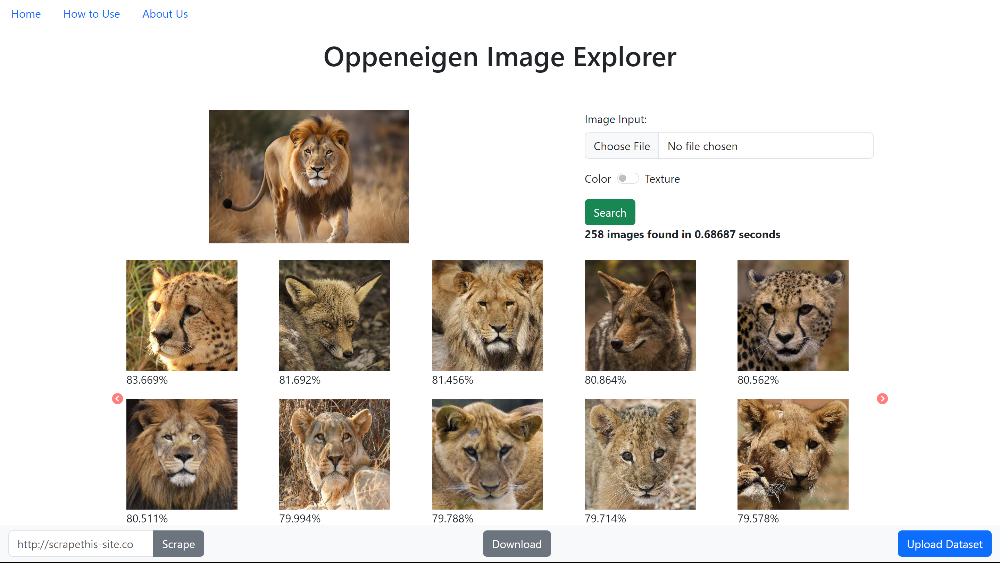
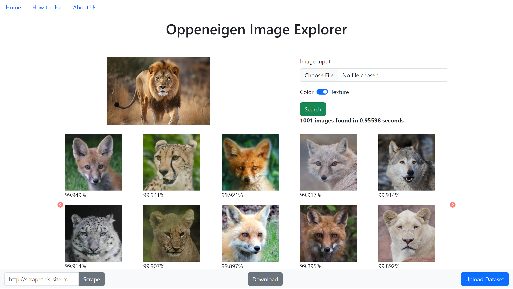
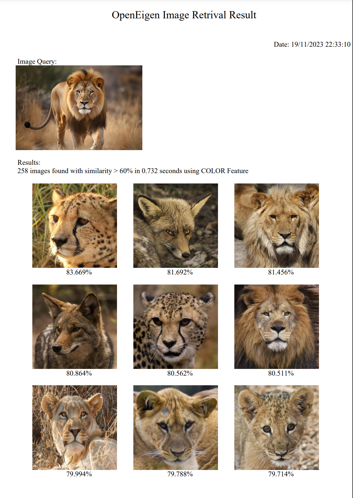

# Oppeneigen Image Retrival System
> CBIR (Content-Based Image Retrieval) using Python Flask is an innovative project that harnesses the power of color and texture features to enable efficient image retrieval. The color feature extraction method in this system is based on the Histogram of HSV (Hue, Saturation, Value) colors. It accurately captures the distribution of colors in images, enabling precise comparison and retrieval of similar images based on color similarity. For texture feature extraction, the system utilizes a Co-occurrence Matrix coupled with various texture parameters. These parameters include: contrast, homogeinity, entropy,  correlation, angular second moment, energy, distortion, dissimilarity, and inverse contrast.

## Table of Contents
* [General Info](#general-information)
* [Technologies Used](#technologies-used)
* [Features](#features)
* [Screenshots](#screenshots)
* [Setup](#setup)

## General Information
- CBIR using color and texture feature
- This project was created to fulfill a major assignment for the Linear Algebra and Geometry courses
<!-- You don't have to answer all the questions - just the ones relevant to your project. -->

## Technologies Used
- Python
- Flask
- Bootstrap
- Numpy
- Opencv
- Pillow
- concurrent.futures
- BeautifulSoup
- FPDF

## Features
List the ready features here:
- CBIR Color Feature
- CBIR Texture Feature
- Upload Multiple Images or Folder of images
- Image Scraper for Dataset
- Download PDF Report
- CSV Database
- Long-task Background Processing

## Screenshots
Color Features CBIR

Texture Feature CBIR

PDF Report

## Setup
Download this repository. Install the modul as trial and error :)